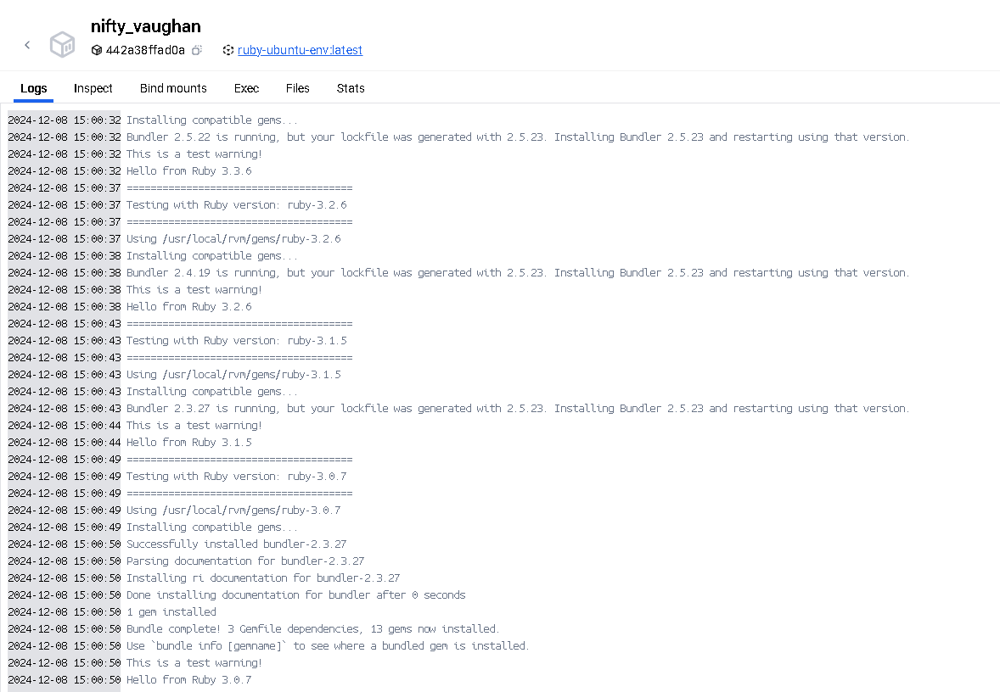
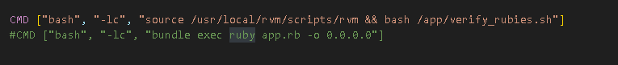

# docker-rvm-ruby-setup

Docker image that provides a comprehensive and standardized environment for running Ruby applications.

# Setup for verification

* `docker build -t <your-image-name> .`
* `docker run <your-image-name>`

## Possibility to run specific app

* Uncomment last command in Dockerfile. Toggle between these two:
  
* in `ruby-app` directory postition your Ruby project.
* Run following commands.
* `docker build -t <your-image-name> .`
* `docker run <your-image-name>`
* If you want to override ports or host address than you run the container with this command:

  * `docker run <local-address>:<container-app-port>:<localhost-port> <image-name>`
  * `docker run -p 8080:4567 <image-name>`

## Demonstration

